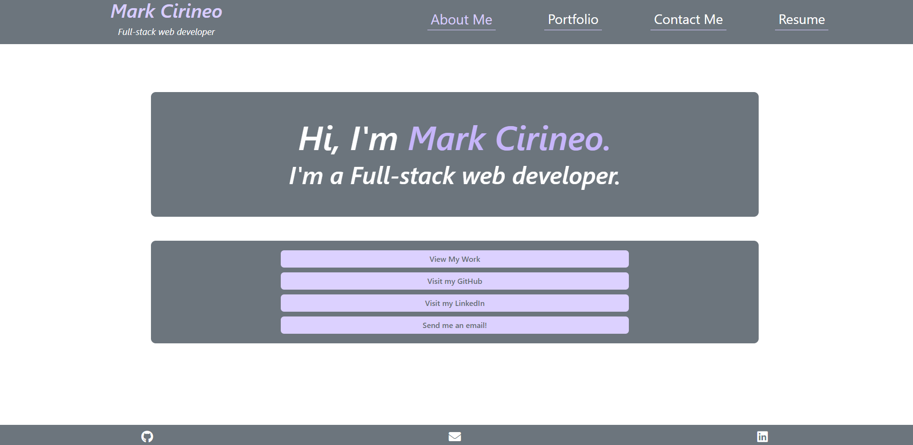
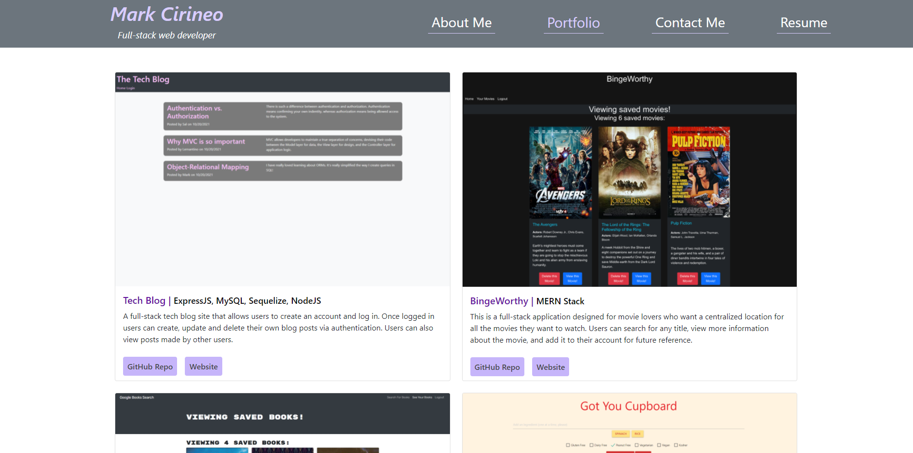

# react-portfolio

## Description
This website is a portfolio of all my previous work. It serves as a place employers can view my previous work to assess my skills as a potential employee, as well as how to contact me. It was built using React.

## Table of Contents
- [Usage](#usage)
- [Installation](#installation)
- [License](#license)
- [How To Contribute](#how-to-contribute)
- [Tests](#tests)
- [Questions](#questions)

## Usage
You can visit the website [here](https://markcirineo.github.io/react-portfolio/)

## Installation
You can use the application through the link above or follow the instructions below to run the files locally.

- Clone the repository to use the files
- Set up the environment variables in a .env file
- Run "npm i" in a terminal at the root directory level to install the dependencies (You need to have Node.js installed on your machine)
- Run "npm run start" in the terminal to run the application
- Go to http://localhost:3000/ in your browser to use the application

## License
MIT License

Copyright (c) 2021 Mark Cirineo

Permission is hereby granted, free of charge, to any person obtaining a copy of this software and associated documentation files (the "Software"), to deal in the Software without restriction, including without limitation the rights to use, copy, modify, merge, publish, distribute, sublicense, and/or sell copies of the Software, and to permit persons to whom the Software is furnished to do so, subject to the following conditions:

The above copyright notice and this permission notice shall be included in all copies or substantial portions of the Software.

THE SOFTWARE IS PROVIDED "AS IS", WITHOUT WARRANTY OF ANY KIND, EXPRESS OR IMPLIED, INCLUDING BUT NOT LIMITED TO THE WARRANTIES OF MERCHANTABILITY, FITNESS FOR A PARTICULAR PURPOSE AND NONINFRINGEMENT. IN NO EVENT SHALL THE AUTHORS OR COPYRIGHT HOLDERS BE LIABLE FOR ANY CLAIM, DAMAGES OR OTHER LIABILITY, WHETHER IN AN ACTION OF CONTRACT, TORT OR OTHERWISE, ARISING FROM, OUT OF OR IN CONNECTION WITH THE SOFTWARE OR THE USE OR OTHER DEALINGS IN THE SOFTWARE.
## How to Contribute
If you want to contribute to the project you can contact me at markcirineo22@gmail.com
## Tests
N/A
## Questions
If you have any question you can view my GitHub Profile [here](https://www.github.com/MarkCirineo), or you can contact me here: markcirineo22@gmail.com